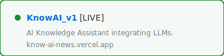
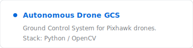
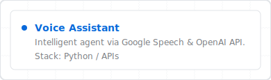
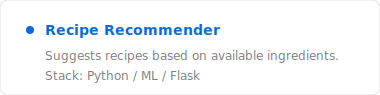
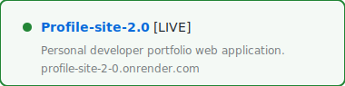

<a target="_blank" href="https://profile-site-2-0.onrender.com/"><picture><source media="(prefers-color-scheme: dark)" srcset="assets/dark/header.svg"/></picture></a>

<a target="_blank" href="https://www.linkedin.com/in/vedant-adulkar/"><picture><source media="(prefers-color-scheme: dark)" srcset="https://img.shields.io/badge/LINKEDIN-0d1117?style=flat-square&logo=linkedin&logoColor=ffffff"/></picture></a>
<a target="_blank" href="https://github.com/VedantAdulkar"><picture><source media="(prefers-color-scheme: dark)" srcset="https://img.shields.io/badge/GITHUB-0d1117?style=flat-square&logo=github&logoColor=ffffff"/></picture></a>

<picture><source media="(prefers-color-scheme: dark)" srcset="assets/dark/whoami.svg"/></picture>

<picture><source media="(prefers-color-scheme: dark)" srcset="assets/dark/experience.svg"/></picture>

<picture><source media="(prefers-color-scheme: dark)" srcset="assets/dark/stack.svg?v=1"/></picture>

<picture><source media="(prefers-color-scheme: dark)" srcset="assets/dark/projects_header.svg"/></picture>

<a target="_blank" href="https://know-ai-news.vercel.app/"><picture><source media="(prefers-color-scheme: dark)" srcset="assets/dark/project_1.svg"/></picture></a>&nbsp;<a target="_blank" href="https://github.com/VedantAdulkar/MA_13_DocSummariser"><picture><source media="(prefers-color-scheme: dark)" srcset="assets/dark/project_2.svg"/></picture></a>

<a target="_blank" href="https://github.com/VedantAdulkar/DroneGCS"><picture><source media="(prefers-color-scheme: dark)" srcset="assets/dark/project_3.svg"/></picture></a>&nbsp;<a target="_blank" href="https://github.com/VedantAdulkar"><picture><source media="(prefers-color-scheme: dark)" srcset="assets/dark/project_4.svg"/></picture></a>

<a target="_blank" href="https://github.com/VedantAdulkar"><picture><source media="(prefers-color-scheme: dark)" srcset="assets/dark/project_5.svg"/></picture></a>&nbsp;<a target="_blank" href="https://profile-site-2-0.onrender.com/"><picture><source media="(prefers-color-scheme: dark)" srcset="assets/dark/project_6.svg"/></picture></a>

 